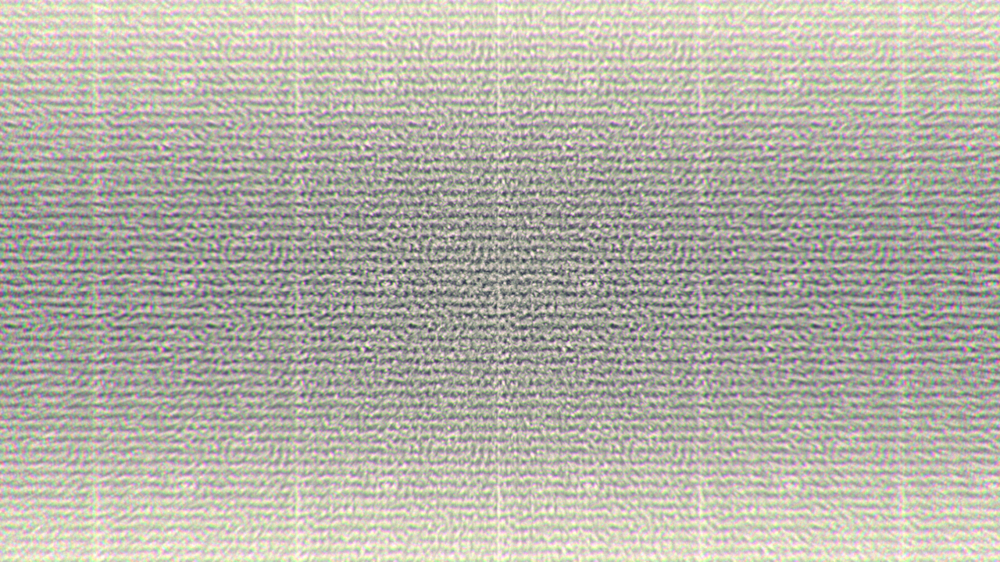
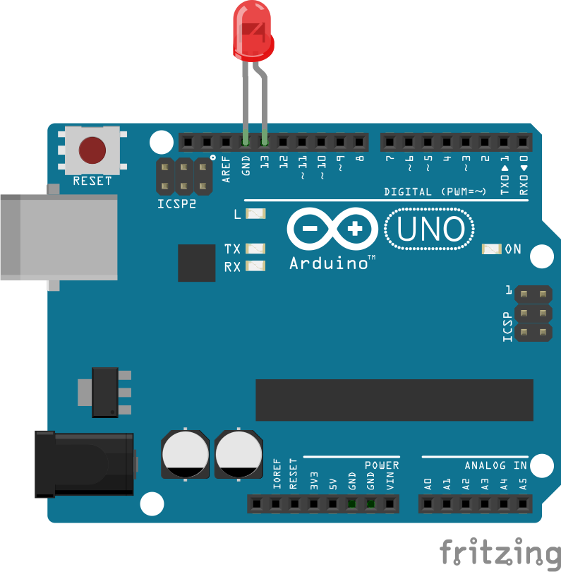

Example-Documentation
=====================
  

##Abstract:  
  
This is my example project. It does not contain anything important. Just an example. You can clone me and build up on it.  

- Add sections as you like.
- Write it in markdown.
- Make it so sombody else can build up on your work.
- Choose a license for your project.  
- Add videos images and anything you like...
- yadi yadi ya bla bla bla.  

With Love by fabiantheblind  

##Contact:  

You can write me an email under <somebody@example.com>  

##Prerequisites:  

To run my project you need  

- [Something](http://example.com)  
- Something else 
- and more  

follow the instrucitons on the respective pages.  


##Setup & Usage:  
  

You just have to draw the nipple by the tongue 
and with the small crank turn to the top. 
Then an arrow appears.
Press it.
Already down there comes out the coffee. 

##License:  
```txt

DO WHAT THE FUCK YOU WANT TO PUBLIC LICENSE  
Version 2, December 2004  

Copyright (C) 2014 Fabian Morón Zirfas aka @fabiantheblind  

Everyone is permitted to copy and distribute verbatim or modified
copies of this license document, and changing it is allowed as long
as the name is changed.  

DO WHAT THE FUCK YOU WANT TO PUBLIC LICENSE
TERMS AND CONDITIONS FOR COPYING, DISTRIBUTION AND MODIFICATION  
0. You just DO WHAT THE FUCK YOU WANT TO.

```